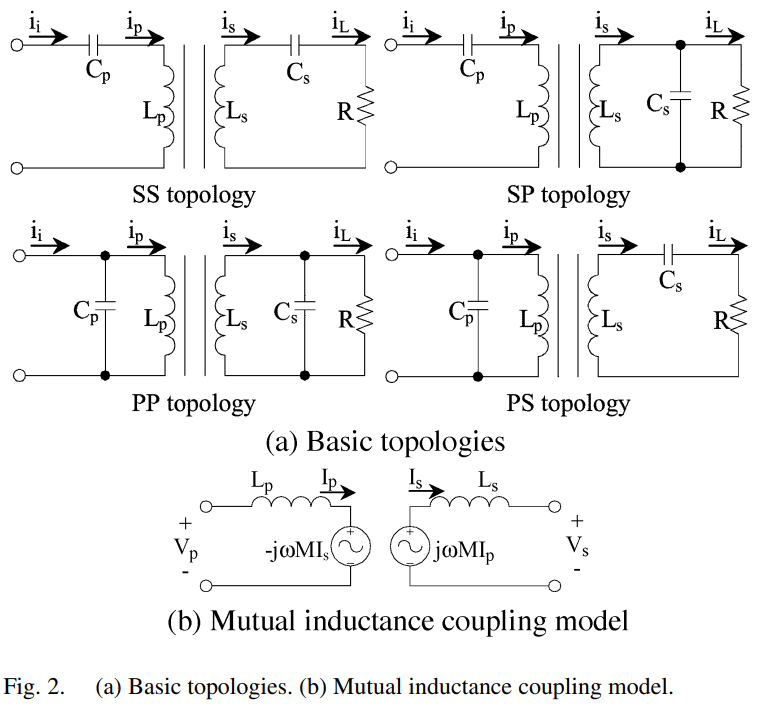

# Introduction

この論文は、ICPT設計に関する論文。

* ICPT(Inductively Coupled Power Transfer): 誘導結合電力伝送。ケーブルを使わず、磁気結合を利用して、静止した電源から動く機器へ大きな隙間を超えて電力を送るシステムのこと。電線がむき出しになっていないため安全で、物理的な接点がないため壊れにくく、長持ちする。
* 共振回路(Resonant circuit)：特定の周波数で電気の振動を最大化する回路のこと。ICPTシステムでは、送電能力を高めるために利用する。

従来の非接触給電の設計は、「決まった周波数で、決まった1次電流を流せば、2次側にこれだけの電力が出る」という、1次側と2次側の相互干渉を最小限に見積もった静的な計算手法だった。

しかし、実際のEV 充電のような過酷な環境(負荷、周波数、位相の変動がある状況)では、このような理想的な家庭に基づいた設計では不十分である。

本論文では、磁気結合の強さをはじめに考慮して、どんな状況でも送電のずれが起きないように、1次共振回路を設計することが目的となる。

# Fundamental Analysis (非接触給電の基礎設計)

まず、非接触給電システムを、反射インピーダンスと共振理論を使ってシンプルな等価回路として扱う。また、その理論は、受電器(ピックアップ)が1つであっても複数であっても、パラメータを適切に等価モデル化することで共通の設計手法が使える。

上図では、システムを基本トポロジーごとに分類し、相互インダクタンスのモデルを用いて、1次側から2次側へどのように電力が伝わるかを数式で解析している。

* トポロジー：送電側と受電側のコンデンサの接続方式の組み合わせのこと。Seriesが直列、Parallelが並列。

2次側のsとp違いによって、ピックアップがどのような出力を出すかを決定する。
* 2次直列 (S: Secondary Series):
  * 特徴: 負荷に対して**「電圧源」**のように振る舞います。
  * 利点: 出力電圧が結合係数 $k$ に依存しにくく、安定しやすいです。
* 2次並列 (P: Secondary Parallel):
  * 特徴: 負荷に対して**「電流源」**のように振る舞います。
  * 利点: 結合が弱い場合でも、高い電圧を発生させて電力を送り込みやすい特性があります。

1次側の接続は、電源から見た動かしやすさに直結する
* 1次直列 (S: Primary Series):
  * 利点: 反射インピーダンス（2次側の影響）が、1次側の共振条件（周波数）に影響を与えません
  * 欠点: 2次側（負荷）がいない状態で動かすと、1次側が短絡（ショート）に近い状態になり、過電流が流れるリスクがあります。
* 1次並列 (P: Primary Parallel):
  * 利点: 2次側がいない状態でもインピーダンスが高く維持されるため、安全性が高いです。
  * 欠点: 反射インピーダンスによって共振周波数が変化してしまうため、制御が複雑になります。

1. 反射インピーダンス

まずは、1次側から2次側の負荷の状態を把握するために、反射インピーダンスを考慮する。これにより、システム全体の設計が可能になる。具体的には以下の流れで反射インピーダンスが発生する。

Ⅰ 1次側の電流$I_p$が流れる

Ⅱ 2次側のコイルに$I_p$による誘導起電力$jωMI_p$が発生し、電流$I_s$が流れる

Ⅲ 1次側のコイルに$I_s$による誘導起電力$-jωMI_s$が発生する。この誘導起電力を$V_r$とし、この$V_r$が仮想的な負荷$Z_r$にかかっているとする。

ここで、1次側から2次側へ伝送される有効電力 $P$ は、1次側回路において反射インピーダンス $Z_r$ の実部（反射抵抗）」で消費される電力と等価になる。
