# 2~4章の全体像

まず、2章にて制御対象である三相インバータのふるまいを数式でモデリングする。このとき、複雑な交流の波をAIが扱いやすい直流のような直交座標へと変換(d-q変換)し、システムをシンプルにする。

2章で整理したインバータのモデルに対して、3章では強化学習が何を観測し、どのような基準で報酬を得て学習するのかというゲームのルールを設定している。

4章では、DDPGアルゴリズム(アクター・クリティック構造)が、複雑な計算を通じてどのように最適なインバータ操作を決定するのかを解説している。

# 2章 SYSTEM MODELING

この章では、系統連結インバータが安定して電力を送るための動的モデルを構築している。

まずは、d-q変換(クラーク変換とパーク変換)により、3相モデルをdq軸に変換する。dq変換を行うことで、インダクタンスの時間依存性を消去して定数化できる。これにより、計算がシンプルになる。また、dq変換は交流を直流として扱えるようにするツールでもある。dq軸電流に変化がない定常状態$di/dt = 0$においては、方程式やベクトル図から時間微分の要素が消え、複雑な交流モータをあたかも直流モータのように、一定値として扱うことができる。

つまり、dq変換によって、常に変化し続ける3相交流が、定常状態においては一定値の2変数として扱えるようになる。

## 2.0. 基礎

まず、前提となるd-q変換の基礎と全体像を把握する。

d-q回転座標系は、ACモータで良く用いられる。ACモータは3相対称巻線を利用している。

3相対称巻線とは、3相の巻線 u, v, w が空間的に120°ずつズレて配置された状態である。電流の条件は、平衡3相交流を流すことであり、3相の電流、電圧は、図べ手同じ振幅で、位相は120°ずつズレている
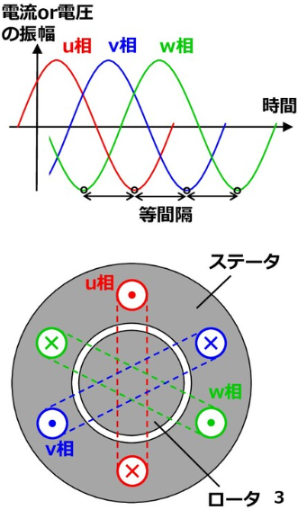

このとき、各コイルに電流を流すと発生する地場の向きも空間的に120°ずつズレる。この空間的ずれを考慮したのが3相座標系という。
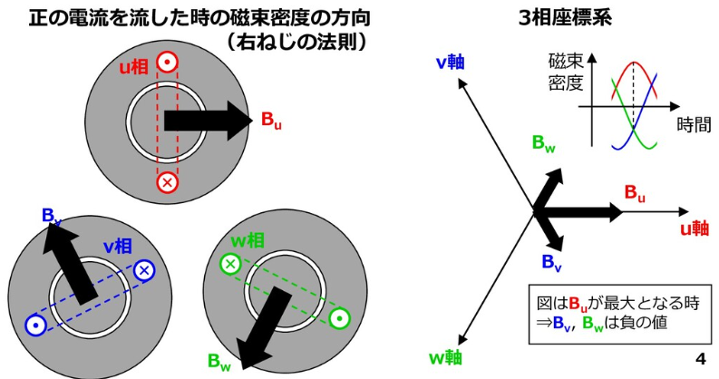

この3相座標系は、線形独立でないため、数学的に扱いにくい。そこで、より扱いやすい直交座標である**α-β座標系**に変換する。
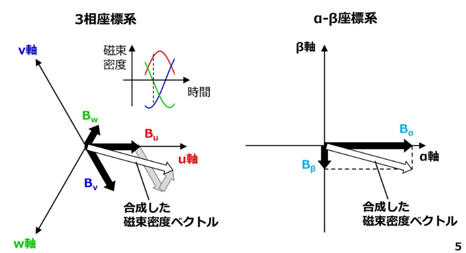

同期モータでは、回転磁界と回転子はどちらも同じ同期速度で回転する。したがって、α-β座標系では時間によってベクトルが変化する。
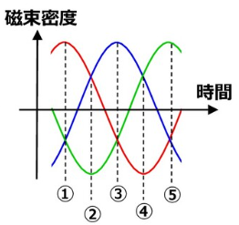
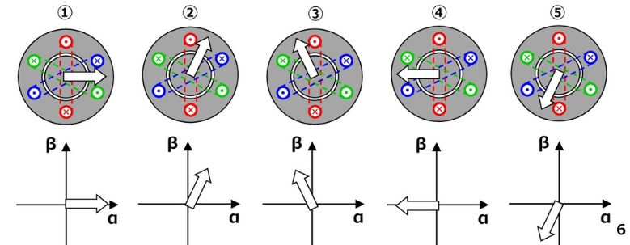

この時間の影響を排除して、同期速度で回転する座標系を考えたらさらに計算が楽になる。この回転座標を**d-q回転座標系**という。下図のように、定常状態において、α-β座標系ではベクトルが変化していたものの、d-q座標系ではベクトルの向きが変わらない。
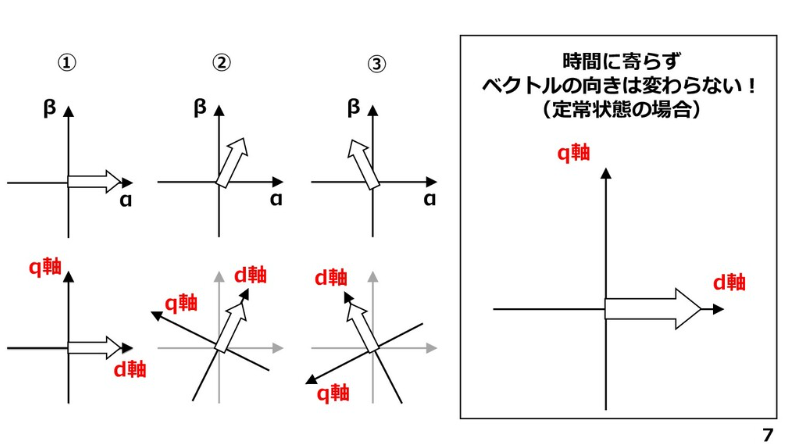

## 2.1.  クラーク変換($\alpha-\beta$変換)

2.0.基礎におけるα-β座標系に変換する作業をクラーク変換という。

クラーク変換とは、固定された3相座標系を、固定された2相座標系に変換する数学的処理。これにより、変数の数が3つから2つに減少し、数学的な取り扱いが容易になる。ただし、この時点ではまだ交流信号のままであり、値は時間とともに変化する。

具体的には、幾何学的に各ベクトルの $\alpha$軸および $\beta$軸への正射影を計算すると、以下の行列として表現できる。

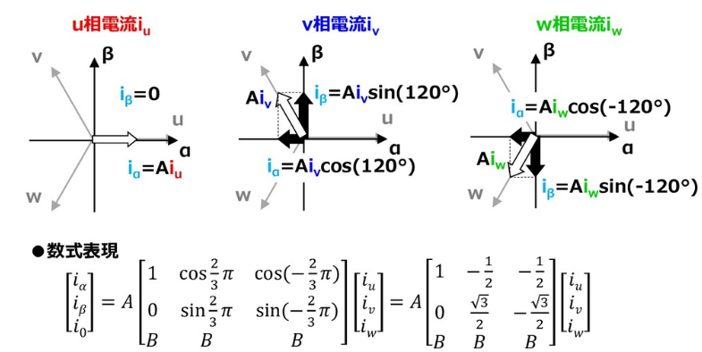

$i_0$は零相成分という。絶対変換における変換行列$C$に逆行列を持たせなければならないことから、3×3の正方行列にするためにこの成分が追加される。入力に校長は成分が含まれる場合や、事故等による短絡で非平衡な三相交流になった場合は零相成分が常に0とは限らないので注意。

この行列におけるAは何？
→2相に変換するとき、そのまま純粋に幾何学的な足し合わせを行うと、電力や振幅の大きさが元の3相の状態からズレてしまう。ここで、係数Aの値を掛けることで、計算上のつじつまを合わせることができる。

このAは、絶対変換と相対変換によって値が変わる。

* **絶対変換**
  絶対変換は、変換前後で電力を一致させるための変換。
  まず、3相座標系での瞬時電力$P_w$は、電圧ベクトル$v$と電力ベクトル$i$の内積で求められる。これを $\alpha-\beta$ 座標系に変換した後の電圧 $\boldsymbol{v}' = C\boldsymbol{v}$ と電流 $\boldsymbol{i}' = C\boldsymbol{i}$ を使って電力 $P_w'$ を計算すると、次のように展開される。
  $$P_w' = \boldsymbol{i}'^T \boldsymbol{v}' = (C\boldsymbol{i})^T (C\boldsymbol{v}) = \boldsymbol{i}^T C^T C \boldsymbol{v}$$

  変換前後で電力が同じ（$P_w' = P_w$）になるためには、$C^T C$が3次の単位行列$I_3$にならなければならない。実際に変換行列 $C$ の積 $C^T C$計算すると、成分は以下のようになる。
  $$C^T C = \begin{bmatrix} A^2(1+B^2) & A^2(-\frac{1}{2}+B^2) & A^2(-\frac{1}{2}+B^2) \\ A^2(-\frac{1}{2}+B^2) & A^2(1+B^2) & A^2(-\frac{1}{2}+B^2) \\ A^2(-\frac{1}{2}+B^2) & A^2(-\frac{1}{2}+B^2) & A^2(1+B^2) \end{bmatrix}$$

  この行列が$C^T C = I_3$を満たす$A$と$B$を導出する。
  * 非対角成分を $0$ にするためには： $-\frac{1}{2} + B^2 = 0$ より $B^2 = \frac{1}{2}$ 。
  * 対角成分を $1$ にするためには： $A^2(1+B^2) = 1$ に $B^2 = \frac{1}{2}$ を代入し、$A^2(\frac{3}{2}) = 1$ 。
  
  よって、係数 $A = \sqrt{\frac{2}{3}}$ が導かれる。

  まとめると、3相から2相に変換する際、そのまま変換すると、変換前後で電力の計算値が変わってしまう。ここで、瞬時電力を不変に保つために、変換される物理量のベクトルの大きさをA倍して補正するってわけ。$C^T C = I_3$（単位行列）を満たすように計算すると、$A = \sqrt{\frac{2}{3}}$となる。
  

* **相対変換**
  相対変換は、変換前後で、入力する物理量(電流や電圧)の振幅を一致させるための変換。
  三相交流の各相の振幅が $I$ である場合、変換後の $\alpha-\beta$ 平面上のベクトルの長さも同じ $I$ になるようにスケールを調整する。
  まず、三相交流電流は、互いに120°（$\frac{2\pi}{3}$）ずつ位相がずれているため、以下のように表される。
  $$\begin{bmatrix} i_u \\ i_v \\ i_w \end{bmatrix} = \begin{bmatrix} I\sin(\omega t) \\ I\sin(\omega t - \frac{2\pi}{3}) \\ I\sin(\omega t + \frac{2\pi}{3}) \end{bmatrix}$$
  これを $\alpha-\beta$ 変換行列（係数 $A$ を含む）に掛け合わせる。
  $$\boldsymbol{i}_a = \begin{bmatrix} i_\alpha \\ i_\beta \end{bmatrix} = A \begin{bmatrix} 1 & -\frac{1}{2} & -\frac{1}{2} \\ 0 & \frac{\sqrt{3}}{2} & -\frac{\sqrt{3}}{2} \end{bmatrix} \begin{bmatrix} i_u \\ i_v \\ i_w \end{bmatrix}$$
  この行列の掛け算を展開し、三角関数の公式を用いて整理すると、以下のようになる。
  $$\begin{bmatrix} i_\alpha \\ i_\beta \end{bmatrix} = \frac{3}{2} A I \begin{bmatrix} \sin(\omega t) \\ -\cos(\omega t) \end{bmatrix}$$
  変換後の合成ベクトルの大きさ$|\boldsymbol{i}_a|$ をピタゴラスの定理で求める。
  $$|\boldsymbol{i}_a| = \sqrt{i_\alpha^2 + i_\beta^2} = \sqrt{\left(\frac{3}{2}AI\sin(\omega t)\right)^2 + \left(-\frac{3}{2}AI\cos(\omega t)\right)^2}$$$$|\boldsymbol{i}_a| [cite_start]= \frac{3}{2} A I$$
  合成ベクトルの大きさをもとの振幅と一致させるのが目的なので、以下の等式が成り立ち、$A$が求まる。
  $$\frac{3}{2} A I = I$$
  $$A = \frac{2}{3}$$
  つまりは、3相交流のベクトルをそのまま$\alpha-\beta$ 平面に投影して合成すると、元の各相の振幅Iに対してベクトルの大きさが$3/2$倍になってしまう。そこで、Aを掛けることで元の振幅と同じになるようにスケールを戻している。$A = \frac{2}{3}$となる。
  **ただし、この変換を用いると、出力やトルクの計算値が実際の3相座標上の値の$\frac{2}{3}$ 倍になってしまうため、制御計算の際には注意。**

この考え方を論文におけるインバータに用いる。論文の図1は、三相インバータを示しており、この物理的な回路を数式に変換することを目指す。

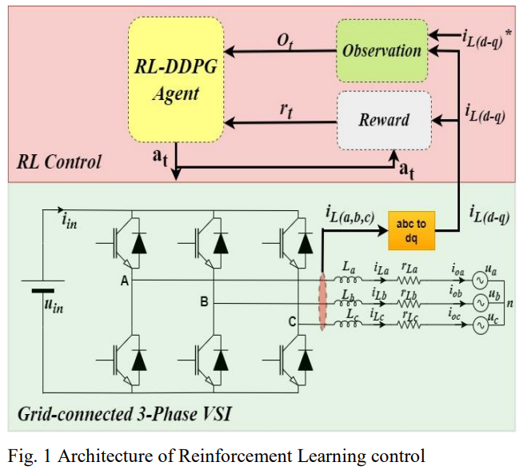

まず、インバータの出力電圧や電流は、a,b,cの三相交流として平均化方程式で表される(式(1)〜(6))。この式は、「インバータのスイッチングによって作り出される電圧（ $\mathbf{d}\langle u_{in} \rangle$ ）」から、「内部抵抗による電圧降下（ $r_{eq}\langle \mathbf{i}_L \rangle$ ）」と「出力先の電圧（ $\langle \mathbf{u}_0 \rangle$ ）」を差し引いたKVLの電圧方程式。$u_{nN}$は、「交流側の中性点（n）」と「直流側の基準点（N）」の間の電位差を表している。これは言い換えると、直流側の「N」と交流側の「n」は直接導線でつながっているわけではないため、この2点間には見えない電位差（ $u_{nN}$ ）が存在することを意味している。

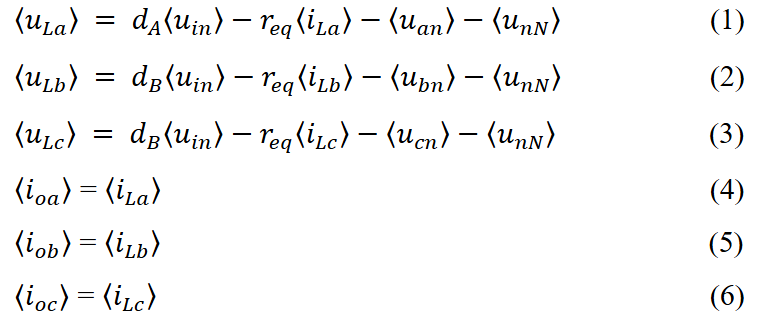

ただし、$r_{eq}=r_sw+r_L$ である。($r_L=r_{L(a,b,c)}$)

ここで、空間ベクトル理論(式(7))を用いて、平衡・対称な三相変数を単一の複素数値に変換する。式7は相対変換を用いて、変換前後で振幅が変化しないようにしている。

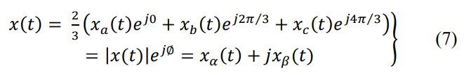

これにより、インバータの動的振る舞いを表す電圧方程式である式(8b)が導かれる。$\langle u_{nN} \rangle$ に対して $(e^{j0} + e^{j2\pi/3} + e^{j4\pi/3})$ が掛けられて、結果$u_{nN}$ の項が丸ごと消え去る。これは、「三相交流のバランスが完全に取れていれば、直流と交流の基準点同士の電圧差はインバータの電流制御モデルに影響を与えない」ということを数式上で証明・整理している。

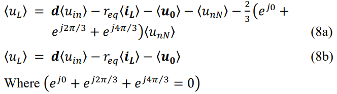

さらに、この式(8b)を、電流の時間微分について解く形に直すと、インバータの出力電流の時間微分方程式(9)となる。

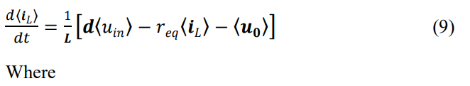
ただし、式(9)のそれぞれの変数の定義を以下にまとめる。dは、三相それぞれのスイッチのオンオフ割合 $d_A, d_B, d_C$ を、式(7)のルールに当てはめて1つのベクトルにまとめたもの。インダクタ電流$\langle \mathbf{i}_L \rangle$は、三相それぞれの電流の平均値 $\langle i_{La} \rangle, \langle i_{Lb} \rangle, \langle i_{Lc} \rangle$ を同様に当てはめたもの。出力電圧$\langle \mathbf{u}_0 \rangle$は、三相それぞれの出力電圧の平均値 $\langle u_{an} \rangle, \langle u_{bn} \rangle, \langle u_{cn} \rangle$ を同様に当てはめたもの。インダクタンス$L$は、三相それぞれのコイルのインダクタンスはすべて同じ値であるとみなして、それをまとめて$L$と置いている。
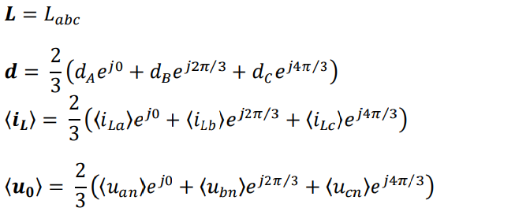

## 2.2. パーク変換($\alpha-\beta$座標系 → d-q座標系)

2.0.基礎におけるd-q回転座標系に変換する作業をパーク変換という。これも同様に、α,β相ベクトルのd,q成分を考えるだけ。

d-q回転座標系は、回転速度$ω$で回転すると仮定するとした図の式が導出される。

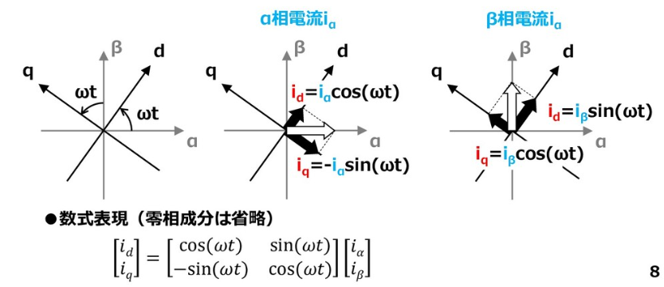

座標軸自体が時間 $t$ とともに角度 $\omega t$ だけ回転していると仮定し、$\alpha$成分と$\beta$成分を三角関数を用いて $d, q$ の各成分に分解する。零相成分を省略すると、以下の行列で表される。

$$\begin{bmatrix} i_d \\ i_q \end{bmatrix} = \begin{bmatrix} \cos(\omega t) & \sin(\omega t) \\ -\sin(\omega t) & \cos(\omega t) \end{bmatrix} \begin{bmatrix} i_\alpha \\ i_\beta \end{bmatrix}$$

クラーク変換とパーク変換を1つにまとめると、以下の行列になる。

$$\begin{bmatrix} i_d \\ i_q \end{bmatrix} = A \begin{bmatrix} \cos(\omega t) & \sin(\omega t) \\ -\sin(\omega t) & \cos(\omega t) \end{bmatrix} \begin{bmatrix} 1 & -\frac{1}{2} & -\frac{1}{2} \\ 0 & \frac{\sqrt{3}}{2} & -\frac{\sqrt{3}}{2} \end{bmatrix} \begin{bmatrix} i_u \\ i_v \\ i_w \end{bmatrix}$$

行列の積を展開し、加法定理を適用させると、数式が整理されて以下の行列になる。

$$\begin{bmatrix} i_d \\ i_q \end{bmatrix} = A \begin{bmatrix} \cos(\omega t) & \cos(\omega t - \frac{2\pi}{3}) & \cos(\omega t + \frac{2\pi}{3}) \\ -\sin(\omega t) & -\sin(\omega t - \frac{2\pi}{3}) & -\sin(\omega t + \frac{2\pi}{3}) \end{bmatrix} \begin{bmatrix} i_u \\ i_v \\ i_w \end{bmatrix}$$

ここまでの計算で、時間とともに波打つ三相交流の値を $d-q$ 座標上では「直流」としてみなすことができ、制御アルゴリズムをシンプルに構築することが可能になった。

論文では、このパーク変換式を式11で表している。式11は、系統の周波数 $\omega_s$（日本なら50Hzや60Hz）と同じスピードで回転する座標系に乗って波を見るための式である。$e^{-j\omega_s t}$ を掛けることで、回転する波と一緒に回る視点になり、波が止まって見える。

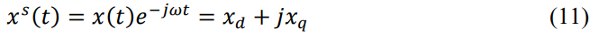

これを$x(t)$ （静止座標系の変数）について解き直すと、両辺に $e^{j\omega_s t}$ を掛けて以下のようになる。
$$x(t) = x^s(t)e^{j\omega_s t}$$

このルールに従い、式(9)の静止座標系の変数（ $\langle \mathbf{i}_L \rangle, \mathbf{d}, \langle \mathbf{u}_0 \rangle$ ）をすべて回転座標系（上付きの $s$ がつく変数）に置き換える。

式(9)の左辺：$$\frac{d\langle \mathbf{i}_L \rangle}{dt} \Rightarrow \frac{d(\langle i_L^s \rangle e^{j\omega_s t})}{dt}$$
式(9)の右辺：$$\frac{1}{L} [\mathbf{d}\langle u_{in} \rangle - r_{eq}\langle \mathbf{i}_L \rangle - \langle \mathbf{u}_0 \rangle] \Rightarrow \frac{1}{L} [d^s e^{j\omega_s t} \langle u_{in} \rangle - r_{eq} \langle i_L^s \rangle e^{j\omega_s t} - \langle u_0^s \rangle e^{j\omega_s t}]$$

これらをまとめて論文では式12に示している。
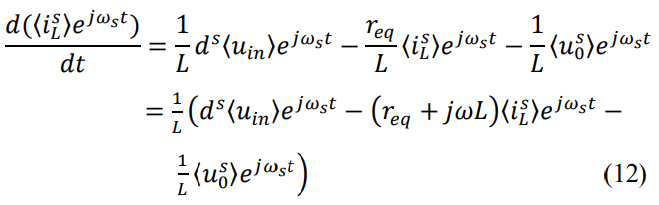

式12の左辺の微分を解くと、以下の式が導出される。($(fg)' = f'g + fg'$)

$$\frac{d(\langle i_L^s \rangle e^{j\omega_s t})}{dt} = \frac{d\langle i_L^s \rangle}{dt} e^{j\omega_s t} + \langle i_L^s \rangle \cdot (j\omega_s e^{j\omega_s t})$$

この式を式9に代入して式12を整理していく。

$$\frac{d\langle i_L^s \rangle}{dt} e^{j\omega_s t} + j\omega_s \langle i_L^s \rangle e^{j\omega_s t} = \frac{1}{L} [d^s \langle u_{in} \rangle - r_{eq} \langle i_L^s \rangle - \langle u_0^s \rangle] e^{j\omega_s t}$$

両辺から $e^{j\omega_s t}$ を消去

$$\frac{d\langle i_L^s \rangle}{dt} + j\omega_s \langle i_L^s \rangle = \frac{1}{L} [d^s \langle u_{in} \rangle - r_{eq} \langle i_L^s \rangle - \langle u_0^s \rangle]$$

$$↓$$

$$\frac{d\langle i_L^s \rangle}{dt} = \frac{1}{L} [d^s \langle u_{in} \rangle - r_{eq} \langle i_L^s \rangle - \langle u_0^s \rangle] - j\omega_s \langle i_L^s \rangle$$

$$↓$$

$$\frac{d\langle i_L^s \rangle}{dt} = \frac{1}{L} [d^s \langle u_{in} \rangle - r_{eq} \langle i_L^s \rangle - j\omega_s L \langle i_L^s \rangle - \langle u_0^s \rangle]$$

$$↓$$

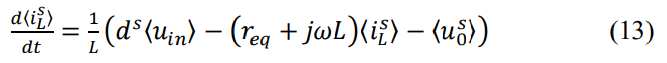

式13で求めた回転座標系（上付き $s$ ）の変数は、それぞれ「実数部（d軸）」と「虚数部（q軸）」を持っている。

$\langle i_L^s \rangle = \langle i_{Ld} \rangle + j\langle i_{Lq} \rangle$
$d^s = d_d + jd_q$
$\langle u_0^s \rangle = \langle u_{od} \rangle + j\langle u_{oq} \rangle$

これを式13にそのまま代入すると
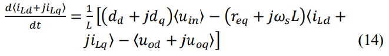

式14を実部と虚部に分けると、実部(d軸)は式15、虚部(q軸)は式16として導出される。
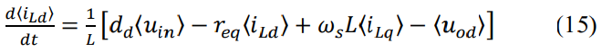
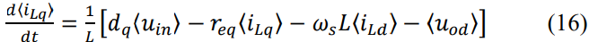

最後に、インバータから出る電流は（ $i_o$ ）は、インダクタを流れる電流（ $i_L$ ）と全く同じなので、(元の式4〜6と同じ意味)
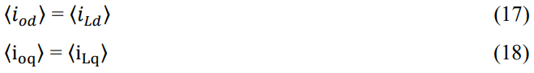

ここまでで、d-q変換が完了した。これにより、定常状態では交流量を一定の直流量として扱うことができ、定常安定性の解析や制御が非常に有利になる。

## 2.3. 有効電力・無効電力の分離

### d-q変換による恩恵

三相交流のままでは、電圧と電流の位相ずれによって発生する無効電力と、実際に仕事をする有効電力が複雑に絡み合っている。これをd-q座標系に変換し、さらにd軸の方向を、系統の出力電圧ベクトルの方向に合わせる。すると、以下のように役割が分離する。

* d軸電流（ $I_{Ld}$ ）：有効電力（ $P$ ）だけを決定する 
* q軸電流（ $I_{Lq}$ ）：無効電力（ $Q$ ）だけを決定する 

インバータから電力ロスなく(力率1で)電力を送るためには、無効電力をゼロに保てばよい。言い換えればq軸の電圧・電流を定常的にゼロにすればよい。この条件下では、インバータは有効電力の実を系統に注入する。
式(19)は、有効電力のみが系統に供給されることを意味している。
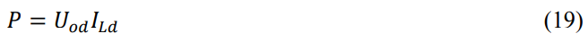

### 小信号モデルへの線形化

式(15)や(16)の大信号モデルには、制御を難しくする非線形項(変数の掛け算)が含まれている。例えば、 $d_d \langle u_{in} \rangle$ は「操作量（デューティ比）」と「入力電圧」という2つの変動する変数が掛け合わされている。これを単純な比例計算で扱えるようにするために、「小信号方程式」を導出する。

小信号モデルは、特定の安定した状態周辺における小さな変動だけを切り取って、比例関係(線形)として扱いやすくした数学モデル。考え方の根本は、テーラー展開の1次近似。初めに各変数を、定常状態の一定値(大文字)と、ごくわずかな変動分（ $\hat{}$ がついた小文字）にわける。

例えば式15において、一定値と微変動値に分けた変数$d_d = D_d + \hat{d}_d$ と $\langle u_{in} \rangle = U_{in} + \hat{u}_{in}$を掛け合わせると、

$(D_d + \hat{d}_d)(U_{in} + \hat{u}_{in}) = D_d U_{in} + D_d \hat{u}_{in} + \hat{d}_d U_{in} + \hat{d}_d \hat{u}_{in}$

となる。ここで、変動分同士の掛け算（ $\hat{d}_d \hat{u}_{in}$ ）は「非常に小さい×非常に小さい＝無視できるほどゼロに近い」として切り捨てる。定常状態の項（ $D_d U_{in}$ ）も動的変化には関係ないので除外する。したがって、残った「 $D_d \hat{u}_{in} + \hat{d}_d U_{in}$ 」が、線形化された動的な変化分となる。

この操作を式15,16のすべて項に行い、定常(SS)動作点を中心とした小信号方程式として表現したのが式20~23。

$$\frac{d\hat{i}_{Ld}}{dt} = \frac{1}{L} [\hat{d}_d U_{in} + D_d \hat{u}_{in} - r_{eq}\hat{i}_{Lq} + \omega_s L\hat{i}_{Ld} - \hat{u}_{od}] \quad (20)$$

$$\frac{d\hat{i}_{Lq}}{dt} = \frac{1}{L} [\hat{d}_q U_{in} + D_q \hat{u}_{in} - r_{eq}\hat{i}_{Lq} - \omega_s L\hat{i}_{Ld} - \hat{u}_{oq}] \quad (21)$$

$$\hat{i}_{od} = \hat{i}_{Lq} \quad (22)$$

$$\hat{i}_{oq} = \hat{i}_{Lq} \quad (23)$$

式20~23で得られた線形な連理部微分方程式を、現代制御理論(AIや高度な制御アルゴリズム)で扱うために、世界共通のフォーマット「状態空間方程式」に変換する。

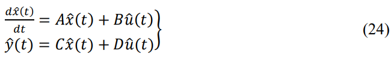

式25~27は、それぞれシステムの状態ベクトル、入力ベクトル、出力ベクトルを表している。

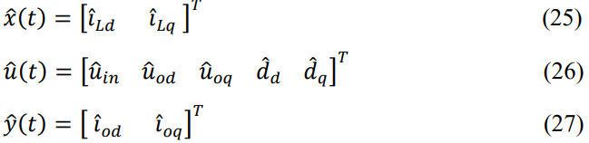

* 状態ベクトル $\mathbf{\hat{x}}(t)$：今のインバータの内部状態（d軸、q軸のインダクタ電流）
* 入力ベクトル $\mathbf{\hat{u}}(t)$：外部からの影響のすべて。自分で操作できるデューティ比（ $\hat{d}_d, \hat{d}_q$ ）と、自分ではどうしようもない外乱（入力電圧 $\hat{u}_{in}$ や系統電圧 $\hat{u}_{od}, \hat{u}_{oq}$ ）がまとめられている。
* 出力ベクトル $\mathbf{\hat{y}}(t)$：最終的に観測したい値（出力電流）。

式20と21の係数を状態行列$A, B, C, D$に当てはめると、以下のようになる。

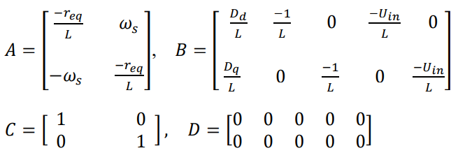

ここまで整理して、やっとAIに「この行列（システム）に対して、どういう $\hat{d}_d, \hat{d}_q$を入力すれば、 $\hat{i}_{Ld}, \hat{i}_{Lq}$ の誤差が最小になるか学習してね」と数式上で指示を出すことができるようになった。

#

# 参考文献

https://yuyumoyuyu.com/2020/07/05/dqrotatingcoordinate1/